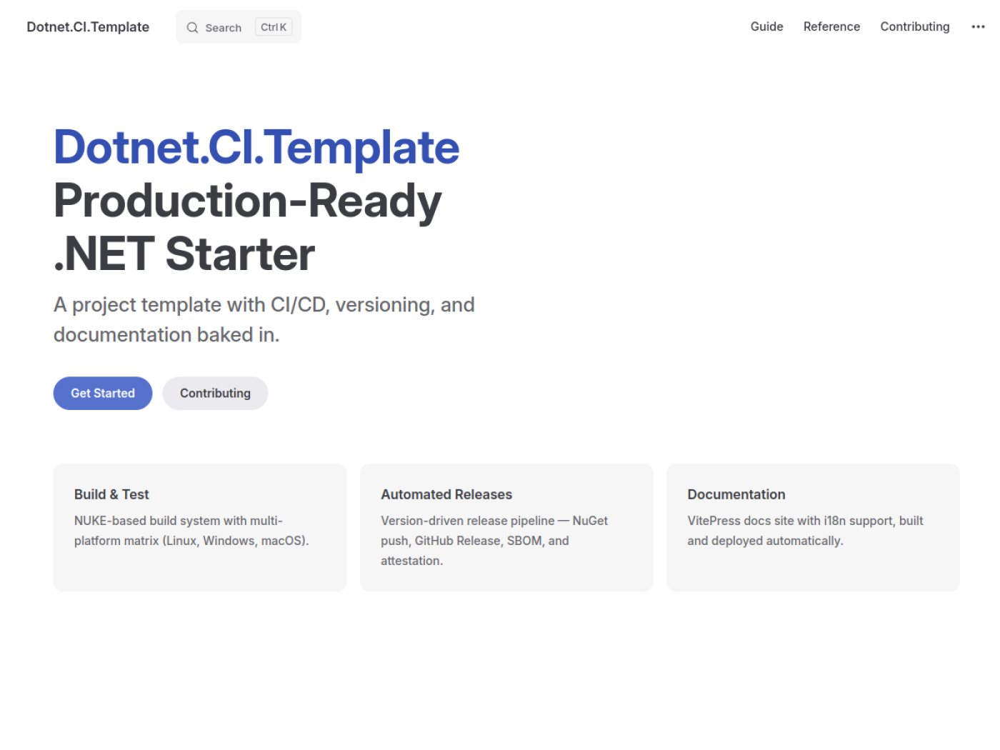
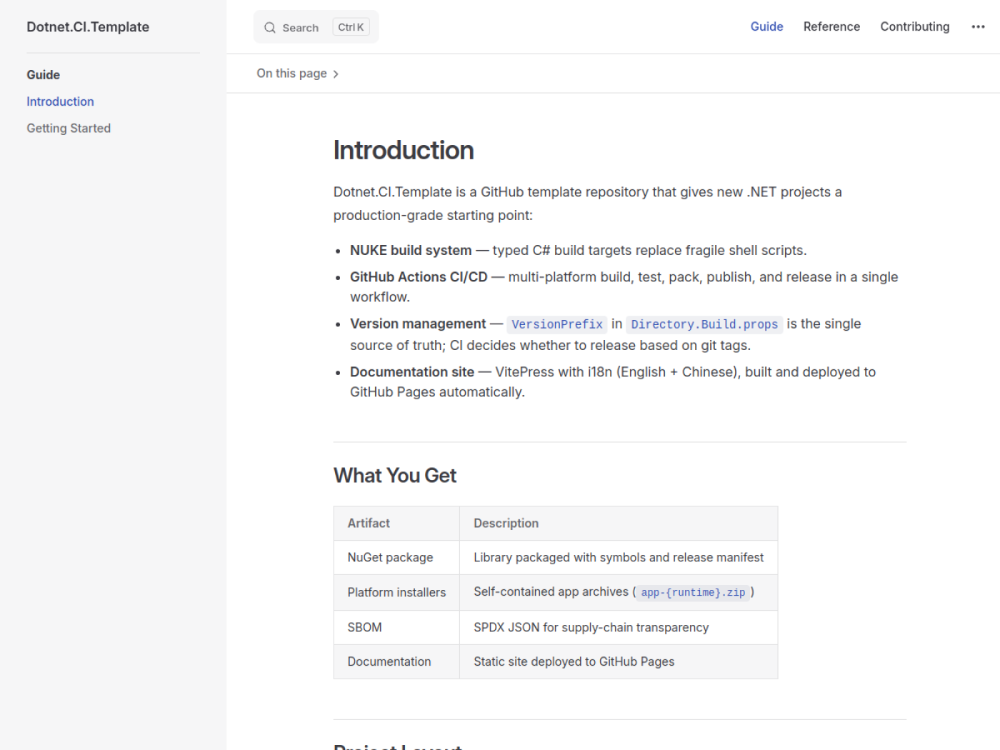
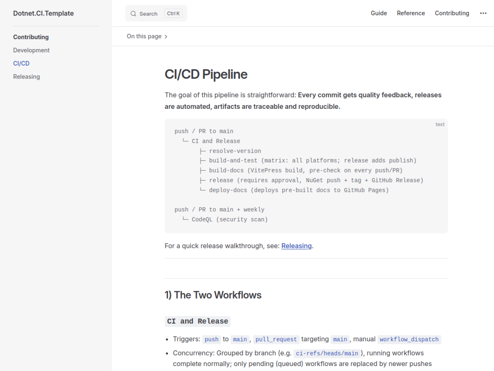

# ChengYuan

[](https://github.com/AGIBuild/dotnet.CI.template/actions/workflows/ci.yml)
[](https://github.com/AGIBuild/dotnet.CI.template/actions/workflows/codeql.yml)
[](LICENSE)

Build your .NET product on top of a complete engineering foundation, not from a blank folder.

This repository is a **productized starter** that gives you:
- a real project structure (`src/`, `tests/`, `docs/`)
- a typed build system (NUKE)
- release-ready delivery (NuGet, GitHub Releases, SBOM, attestation)
- multilingual documentation (English + Chinese)

CI/CD is here, but it is not the protagonist; your product is.



## Why This Repo Exists

Most new projects lose momentum in the first week to repetitive setup:
- wiring build scripts
- writing CI pipelines
- standardizing versioning
- bolting on documentation later

`ChengYuan` removes that tax. You start with a working product baseline and focus on business features from day one.

## Product Capabilities

| Capability | What You Get | Why It Matters |
|---|---|---|
| Product-ready structure | `src`, `tests`, `docs`, centralized build properties | Clear boundaries from the beginning |
| Build system | NUKE targets in `build/BuildTask.*.cs` | Build logic in C#, not YAML sprawl |
| Version model | `VersionPrefix` as single source of truth | Reproducible, auditable releases |
| Delivery pipeline | Build, test, pack, publish, package, release | One flow from code to artifacts |
| Supply-chain trust | SBOM + artifact attestation | Better compliance and traceability |
| Documentation portal | VitePress with i18n and auto deployment | Docs evolve with code, not after it |

## Experience Snapshot

### Product-first docs experience



### CI/CD as one module in Contributing



## What Makes It Better Than Starting Empty

| Comparison | Blank Repo | ChengYuan |
|---|---|---|
| First successful release | days of setup | built-in path |
| Build orchestration | mixed shell + YAML | NUKE targets |
| Version governance | manual and error-prone | semantic, code-owned |
| Documentation | added later (often stale) | integrated from day one |
| Artifact provenance | optional / inconsistent | standardized |

## Architecture At A Glance

```text
Product Code (src/) + Tests (tests/)
          |
          v
    NUKE Build Targets (build/)
          |
          v
 CI and Release Workflow (.github/workflows/ci.yml)
          |
          +--> Packages (.nupkg/.snupkg)
          +--> Installers (app-{runtime}.zip)
          +--> SBOM + Attestation
          +--> Docs Site (GitHub Pages)
```

## Quick Start

1. Create your repository from this template:
  [Use this template](https://github.com/AGIBuild/dotnet.CI.template/generate)
2. Restore, build, and validate the current skeleton:

```bash
dotnet restore ChengYuan.slnx
dotnet build ChengYuan.slnx
dotnet test --solution ChengYuan.slnx
```

3. Run one of the thin hosts to verify composition:

```bash
dotnet run --project src/Hosts/WebHost
dotnet run --project src/Hosts/CliHost
```

4. Configure `release` environment in GitHub (`Settings` -> `Environments`)
5. Add `NUGET_API_KEY` secret (if `ENABLE_NUGET` is `true`)
6. Review [Feature Switches](#feature-switches), then push to `main`

## Feature Switches

All switches live in `.github/workflows/ci.yml` under the top-level `env:` block.

| Switch | Default | Purpose |
|---|---|---|
| `ENABLE_NUGET` | `true` | NuGet package generation and publishing |
| `NUGET_USE_OIDC` | `false` | `false` = API key, `true` = Trusted Publishing (OIDC) |
| `ENABLE_INSTALLERS` | `true` | Platform installer zips (Publish + PackageApp) |
| `ENABLE_ANDROID` | `false` | Android workload in build matrix |
| `ENABLE_IOS` | `false` | iOS workload in build matrix |

When `ENABLE_NUGET` is `true`, either `NUGET_API_KEY` secret or OIDC trust policy must be configured; otherwise the release will fail with a clear error.

## Key Commands

```bash
./build.sh ShowVersion                            # show current version
./build.sh UpdateVersion                          # patch increment
./build.sh UpdateVersion --VersionPrefix 1.0.0    # set exact version
./build.sh Test                                   # build + test
./build.sh Pack                                   # build + test + pack
./build.sh Benchmark                              # run benchmarks (benchmarks/ projects)
./build.sh MutationTest                           # run Stryker.NET mutation testing
```

## Documentation

- Live docs: `https://agibuild.github.io/dotnet.CI.template/`
- Product docs are organized as:
  - `guide/` (product understanding and onboarding)
  - `reference/` (API/reference content)
  - `contributing/` (development, CI/CD, releasing)

## License

[MIT](LICENSE)
